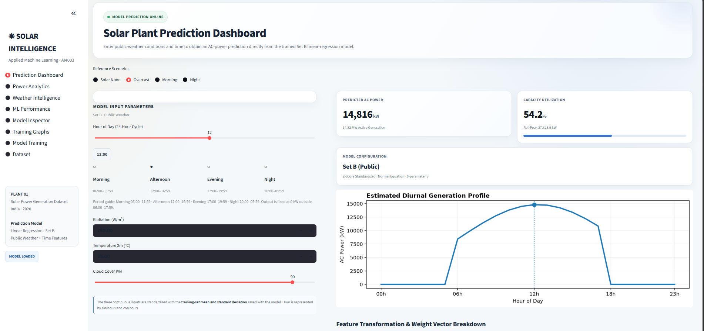

# ☀️ Solar Plant Intelligence Dashboard

> **AI4003 — Applied Machine Learning**  
> A complete machine-learning project for **solar AC-power prediction and analytics** using manually implemented Linear Regression with NumPy and an interactive Streamlit dashboard.

---

## 📌 Project Overview

**Solar Plant Intelligence** is an end-to-end solar power prediction system designed to analyze historical solar-plant data, combine plant measurements with public weather information, train Linear Regression models, evaluate different optimization methods, and provide an interactive prediction dashboard.

### End-to-end workflow

**Raw Data → Data Preparation → Exploratory Analysis → Weather Integration → Feature Engineering → Model Training → Evaluation → Prediction → Interactive Dashboard**

The project supports two feature sets:

- **Set A — Plant Sensor Features**
- **Set B — Public Weather Features**

The live dashboard uses **Set B (Public Weather)** for prediction.

---

## 🎯 Objectives

- Prepare and clean solar generation and weather-sensor datasets.
- Aggregate plant generation data at hourly resolution.
- Handle missing values during data preparation.
- Integrate public weather data from Open-Meteo.
- Perform exploratory data analysis.
- Engineer cyclic time features using `sin(hour)` and `cos(hour)`.
- Implement Linear Regression manually using NumPy.
- Compare Normal Equation, Batch Gradient Descent, and Stochastic Gradient Descent.
- Evaluate models using RMSE for all hours and daytime-only observations.
- Analyze learned model parameters.
- Build an interactive Streamlit prediction dashboard.

---

# 🧠 Machine Learning Approach

The project implements Linear Regression manually rather than using a high-level regression estimator.

The prediction is:

```text
ŷ = Xθ
```

The dashboard applies:

```text
prediction = max(0, Xθ)
```

to prevent negative AC-power predictions.

### Implemented solvers

1. **Normal Equation**
2. **Batch Gradient Descent**
3. **Stochastic Gradient Descent**

The core implementation is in `src/regression.py`.

---

# 📊 Feature Sets

## Set A — Plant Sensor Features

| Feature | Description | Unit |
|---|---|---|
| `irradiation` | Solar irradiation measured by plant sensor | kW/m² |
| `module_temp` | PV module temperature | °C |
| `ambient_temp` | Ambient temperature | °C |
| `sin_hour` | Cyclic hour feature | — |
| `cos_hour` | Cyclic hour feature | — |

## Set B — Public Weather Features

| Feature | Description | Unit |
|---|---|---|
| `sw_radiation` | Shortwave radiation | W/m² |
| `temp_2m` | 2 m air temperature | °C |
| `cloud_cover` | Cloud cover | % |
| `sin_hour` | Cyclic hour feature | — |
| `cos_hour` | Cyclic hour feature | — |

The three continuous weather variables are standardized using the **training-set mean and standard deviation saved with the trained model**.

---

# 🗂️ Repository Structure

```text
SolarPowerPrediction/
│
├── app/
│   ├── app.py
│   └── style.css
│
├── data/
│   ├── open_meteo_weather.csv
│   ├── Plant_1_Generation_Data.csv
│   ├── Plant_1_Weather_Sensor_Data.csv
│   ├── Plant_2_Generation_Data.csv
│   ├── Plant_2_Weather_Sensor_Data.csv
│   ├── plant1_hourly_openmeteo.csv
│   ├── plant1_hourly.csv
│   └── plant1_openmeteo.csv
│
├── results/
│   ├── figures/
│   │   └── ...
│   ├── weights/
│   │   └── ...
│   ├── analysis.md
│   ├── table2_test_rmse.csv
│   ├── table3_theta_set_a.csv
│   └── train_eval_summary.json
│
├── src/
│   ├── __pycache__/
│   ├── eda.py
│   ├── fetch_weather.py
│   ├── load_data.py
│   ├── prepare.py
│   ├── regression.py
│   └── train_eval.py
│
├── venv/                    # local environment; do not commit
├── README.md
└── requirements.txt
```

> **GitHub tip:** add `venv/` and `__pycache__/` to `.gitignore` so local Python environment files are not uploaded.

---

# 📁 Directory and File Description

### `app/`
Contains the Streamlit frontend.

- **`app.py`** — loads the trained model, accepts inputs, generates predictions, and provides analytics, model inspection, training graphs, dataset information, and training controls.
- **`style.css`** — custom styling for the dashboard interface.

### `data/`
Contains raw, prepared, and public-weather datasets.

- `Plant_1_Generation_Data.csv`
- `Plant_1_Weather_Sensor_Data.csv`
- `Plant_2_Generation_Data.csv`
- `Plant_2_Weather_Sensor_Data.csv`
- `open_meteo_weather.csv`
- `plant1_openmeteo.csv`
- `plant1_hourly.csv`
- `plant1_hourly_openmeteo.csv`

### `src/`
Contains the complete data-processing and machine-learning pipeline.

- **`load_data.py`** — loads generation and weather CSV files.
- **`prepare.py`** — parses timestamps, aggregates generation, merges sensor data, resamples hourly, and handles missing values.
- **`fetch_weather.py`** — prepares hourly Open-Meteo public weather data and merges it with the plant dataset.
- **`eda.py`** — generates exploratory analysis figures.
- **`regression.py`** — manually implements hypothesis, cost, Normal Equation, Batch GD, SGD, and RMSE.
- **`train_eval.py`** — creates feature sets, performs the chronological train/test split, trains all solvers, evaluates them, and saves model artifacts and figures.

### `results/`
Contains reproducible outputs from training and evaluation.

- `figures/` — analysis and training plots.
- `weights/` — saved trained model parameters and preprocessing statistics.
- `table2_test_rmse.csv` — model RMSE comparison.
- `table3_theta_set_a.csv` — Set A learned parameters.
- `train_eval_summary.json` — training/evaluation summary.
- `analysis.md` — generated analysis notes.

---

# 🖥️ Frontend / Dashboard Design

The project includes an interactive **Streamlit web dashboard** with a clean analytics-style interface.

### Dashboard features

- Left-side navigation sidebar.
- Model status indicator.
- Reference prediction scenarios.
- Hour-of-day input.
- Shortwave-radiation input.
- Temperature input.
- Cloud-cover input.
- Predicted AC-power card.
- Capacity-utilization card.
- Model configuration card.
- Estimated 24-hour diurnal generation profile.
- Feature transformation and weight breakdown.
- Power analytics.
- Weather intelligence.
- ML performance.
- Model inspector.
- Training graphs.
- Model training controls.
- Dataset view.

### Dashboard Pages

```text
Prediction Dashboard
Power Analytics
Weather Intelligence
ML Performance
Model Inspector
Training Graphs
Model Training
Dataset
```

### Dashboard Preview


The dashboard uses **Set B (Public Weather)** for live prediction. Users provide weather/time conditions, the application applies the saved training-set standardization parameters, and the trained model returns AC power in kW.

### Reference Scenarios

The interface includes convenient presets such as:

- Solar Noon
- Overcast
- Morning
- Night

These scenarios make demonstrations easier and show how changes in weather and time affect predicted generation.

---

# 📈 Training Results

Training was performed using the supplied project data.

| Solver | Features | All-hours RMSE (kW) | Daytime RMSE (kW) |
|---|---|---:|---:|
| Normal Equation | Set A | 544.223 | 710.134 |
| Batch GD (`α=0.0001`, 20,000 iterations) | Set A | 544.337 | 710.278 |
| Stochastic GD (`α=0.01`, 50 epochs) | Set A | 561.935 | 734.627 |
| Normal Equation | Set B | 3167.816 | 3989.990 |
| Batch GD (`α=0.0001`, 20,000 iterations) | Set B | 3167.816 | 3989.990 |
| Stochastic GD (`α=0.01`, 50 epochs) | Set B | 2985.071 | 3829.018 |

---

# 🧮 Set A Learned Parameters

Set A Normal Equation:

| Feature | θ |
|---|---:|
| Intercept | 6803.188733 |
| Irradiation | 8187.254344 |
| Module Temperature | 5.329879 |
| Ambient Temperature | -65.130812 |
| Sin Hour | -86.115151 |
| Cos Hour | -606.321145 |

The maximum absolute difference between the Set A Batch GD and Normal Equation parameters is approximately:

```text
3.0953
```

For Set B, the maximum absolute difference between Batch GD and Normal Equation parameters is approximately:

```text
1.02 × 10⁻¹⁰
```

---

# 🌦️ Public Weather Model

The live application uses **Set B — Public Weather**.

Its model input vector contains:

```text
[intercept,
 standardized sw_radiation,
 standardized temp_2m,
 standardized cloud_cover,
 sin_hour,
 cos_hour]
```

The trained Set B weights and preprocessing statistics are stored under:

```text
results/weights/
```

The dashboard loads these saved artifacts so predictions do not require retraining on every application start.

---

# 🔬 Model Evaluation

Model performance is evaluated using **Root Mean Squared Error (RMSE)**.

Two evaluation views are reported:

### All Hours

Includes daytime and nighttime observations.

### Daytime Only

Focuses on solar-generation hours, making it useful for analyzing prediction quality during active generation.

---

# 📊 Generated Analysis

The `results/figures/` directory contains the visual outputs produced by the project, including figures for:

1. Exploratory Data Analysis.
2. Sensor irradiation vs. Open-Meteo radiation.
3. Batch Gradient Descent cost vs. iteration.
4. Stochastic Gradient Descent cost vs. epoch.
5. Actual vs. predicted AC power on the test week.
6. Residuals vs. hour of day.
7. Frontend/dashboard presentation.

These figures can be used in the academic report's Results section.

---

# ⚙️ Installation

## 1. Clone the repository

```bash
git clone https://github.com/<your-username>/SolarPowerPrediction.git
cd SolarPowerPrediction
```

Replace `<your-username>` with your GitHub username.

## 2. Create a virtual environment

### Windows

```bash
python -m venv venv
venv\Scripts\activate
```

### Linux / macOS

```bash
python3 -m venv venv
source venv/bin/activate
```

## 3. Install dependencies

```bash
pip install -r requirements.txt
```

---

# ▶️ Run the Dashboard

From the project root:

```bash
streamlit run app/app.py
```

Then open the local Streamlit URL, normally:

```text
http://localhost:8501
```

---

# 🔁 Retrain the Complete Model

Run the following commands from the project root:

### Step 1 — Prepare data

```bash
python src/prepare.py
```

### Step 2 — Prepare/fetch public weather data

```bash
python src/fetch_weather.py
```

### Step 3 — Train and evaluate

```bash
python src/train_eval.py
```

The dashboard also provides a **Model Training** page for running the pipeline from the UI.

---

# 🧪 Reproducibility Workflow

```text
Plant Generation CSV
        │
        ▼
   Data Loading
        │
        ▼
 Data Preparation
        │
        ▼
 Hourly Plant Dataset
        │
        ├───────────────┐
        │               │
        ▼               ▼
 Plant Sensor       Open-Meteo
   Features           Weather
        │               │
        └───────┬───────┘
                ▼
        Feature Engineering
                │
                ▼
          Set A / Set B
                │
                ▼
       Train / Test Split
                │
                ▼
     ┌──────────┼──────────┐
     ▼          ▼          ▼
 Normal Eq.   Batch GD    SGD
     │          │          │
     └──────────┼──────────┘
                ▼
             RMSE
                │
                ▼
        Saved Model Weights
                │
                ▼
       Streamlit Dashboard
                │
                ▼
        Live Prediction
```

---

# 🧱 Project Architecture

```text
                    ┌───────────────────────┐
                    │     Raw CSV Data      │
                    └───────────┬───────────┘
                                │
                                ▼
                    ┌───────────────────────┐
                    │   Data Preparation    │
                    │      prepare.py       │
                    └───────────┬───────────┘
                                │
                                ▼
                    ┌───────────────────────┐
                    │    Hourly Dataset     │
                    └───────────┬───────────┘
                                │
                  ┌─────────────┴─────────────┐
                  ▼                           ▼
        ┌─────────────────┐         ┌─────────────────┐
        │     Set A       │         │      Set B      │
        │ Plant Sensors   │         │ Public Weather  │
        └────────┬────────┘         └────────┬────────┘
                 │                           │
                 └─────────────┬─────────────┘
                               ▼
                    ┌───────────────────────┐
                    │  Linear Regression    │
                    │ Normal Eq / GD / SGD  │
                    └───────────┬───────────┘
                                │
                                ▼
                    ┌───────────────────────┐
                    │ Model Evaluation      │
                    │        RMSE           │
                    └───────────┬───────────┘
                                │
                                ▼
                    ┌───────────────────────┐
                    │ Saved Model Artifacts  │
                    └───────────┬───────────┘
                                │
                                ▼
                    ┌───────────────────────┐
                    │ Streamlit Dashboard   │
                    └───────────────────────┘
```

---

# 🛠️ Technologies Used

| Technology | Purpose |
|---|---|
| Python | Main programming language |
| NumPy | Numerical computation and ML implementation |
| Pandas | Data loading and preprocessing |
| Matplotlib | Graphs and visualization |
| Streamlit | Interactive web dashboard |
| CSS | Dashboard styling |
| Open-Meteo | Public weather data |
| Git / GitHub | Version control and project hosting |

---

# 📦 Main Project Outputs

Important generated artifacts are stored in:

```text
data/
results/
```

Important outputs include:

```text
results/weights/
results/table2_test_rmse.csv
results/table3_theta_set_a.csv
results/train_eval_summary.json
results/analysis.md
```

---

## 🌐 Frontend App


# 📌 Important Implementation Detail

`plant1_hourly_openmeteo.csv` may already contain `ac_power` and on-site columns.

For Set B, the loader deliberately selects only the public-weather predictors before merging the plant target. This prevents duplicate columns such as:

```text
ac_power_x
ac_power_y
```

and ensures that **AC power remains the prediction target rather than an input feature**.

---

# 📐 Data and Target Definition

The model predicts:

```text
AC Power
```

The project reports the prediction target in:

```text
kW
```

The dashboard additionally presents active generation in:

```text
MW
```

for easier plant-scale visualization.

---

# 🚀 Future Improvements

Possible future extensions include:

- Compare additional machine-learning algorithms.
- Add Random Forest and Gradient Boosting models.
- Add time-series models such as LSTM.
- Add longer-range weather forecasting.
- Add real-time solar plant sensor integration.
- Add automatic model retraining.
- Add model monitoring and drift detection.
- Add prediction-confidence information.
- Add database-backed historical predictions.
- Add prediction report downloads.
- Add plant-level comparison for Plant 1 and Plant 2.
- Deploy the Streamlit dashboard publicly.

---

# 👨‍💻 Project Information

| Item | Details |
|---|---|
| Project | Solar Plant Intelligence Dashboard |
| Course | AI4003 — Applied Machine Learning |
| Application | Solar AC-Power Prediction |
| Model | Manually Implemented Linear Regression |
| Frontend | Streamlit + CSS |
| Weather Source | Open-Meteo |
| Data Processing | Python + Pandas |
| Numerical Computing | NumPy |

---

# 📄 License

This project was developed as an academic machine-learning project. Add your preferred license if the repository is intended for public distribution.

---

## ⭐ Project Summary

**Solar Plant Intelligence** demonstrates a complete applied machine-learning workflow:

> **Data → Processing → Analysis → Feature Engineering → Regression → Evaluation → Visualization → Deployment**

The final Streamlit dashboard turns the trained regression model into an interactive solar-power prediction application, while the saved results and figures provide reproducible evidence of model training and evaluation.
